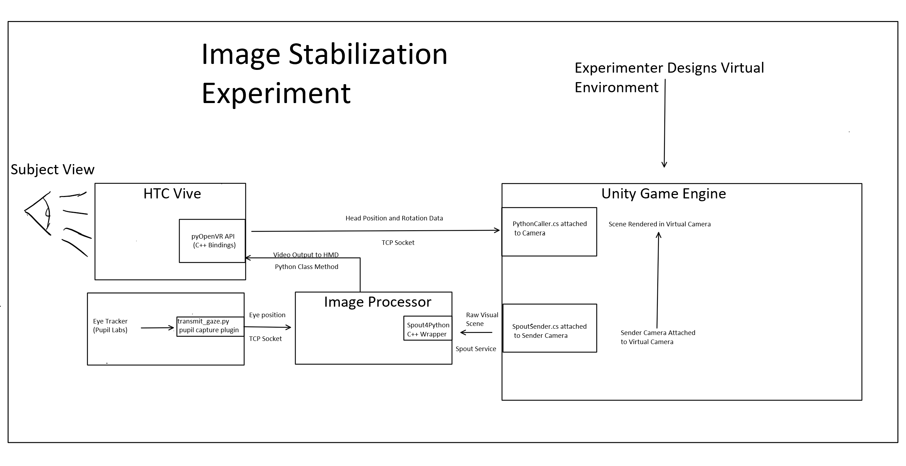

# VR Image Stabilization
 Image Stabilization on an HTC Vive with Pupil Labs Eye Tracking

# Overview
This is the first instance of Python/Unity code that is intended to create a Virtual reality environment that allows for 
images to be stabilized on the wearere's retina.  The setup is diagrammed below. Briefly, a virtual environment is contstructed in Unity. The Experiment.py file contains a VR interface which captures head tracking data and sends it to Unity via TCP socket and attached PythonCaller.cs script. The image from the Unity camera is then captured and transmitted efficiently via Spout back to the Python Image processor module, which integrates eye tracking data to generate an image that is fixed on the retina of the wearer.
This image is then sent back through the VR interface and is finally displayed to the wearer. 

While a proof-of-concept simulation is possible in its current form, this project is incomplete and is in need of optimization. In particular, it relies on disabling the HTC Vive direct-display mode to treat the VR set as a monitor and manually positioning a display window over the wearer's eyes. There is an OpenGL render-to-texture implemenation that can display images directly to the user using the OpenVR API, but is not yet fully working. (See testbed.py for more information). Furthermore, the image processor needs overhauling to increase the framerate to a reasonable level as well as calibration to the eye tracking data. 

For the diagram, the convention for arrows is that the text above an error describes the data being moved, and the text below describes the pipeline (i.e. how it's being moved).  In the main components, a smaller subbox connecting to an arrow denotes an interface, which here is a particular piece of code that serves to talk between two different languages (here Pyhon, C++, and C#).
